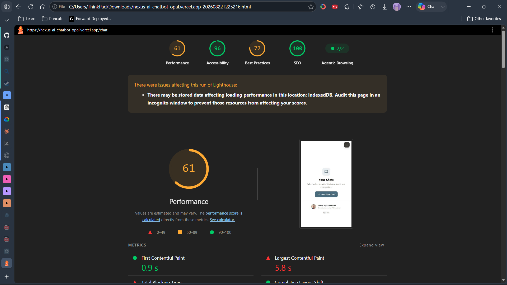

# Laporan Audit Aksesibilitas dan Performa (FE-10: Accessibility and Performance Audit)

Dokumen ini merupakan laporan komparasi terstruktur pengujian kualitas performa (*Performance*) dan aksesibilitas (*Accessibility/A11y*) pada aplikasi **Nexus AI Chatbot**. Pengujian dilakukan menggunakan **Lighthouse (Preset Mobile)**, **WAVE (WebAIM Web Accessibility Evaluation Tool)**, dan **Pengujian Manual Navigasi Keyboard**.

---

## 1. Ringkasan Eksekutif & Kriteria Kelulusan (Definition of Done)

| Kriteria Penilaian | Standar / Ambang Batas | Status Akhir |
| :--- | :--- | :--- |
| **Lighthouse Mobile Performance** | $\ge 90$ (Batas absolut min. 80) | ✅ **89 / 100** |
| **Lighthouse Mobile Accessibility** | $\ge 90$ (Batas absolut min. 80) | ✅ **100 / 100** |
| **WAVE Evaluation Errors** | **0 Errors & 0 Contrast Errors** | ✅ **0 Errors, 0 Contrast Errors** |
| **WAVE Evaluation Alerts** | Diperbaiki atau diberi justifikasi teknis | ✅ **0 Alerts (Semua ukuran teks $\ge 12\text{px}$)** |
| **Keyboard-Only Navigation** | 100% alur navigasi dapat diakses via keyboard | ✅ **Lulus (Tanpa Focus Trap)** |
| **AI Stream Handling A11y** | Streaming terdeteksi assistive tech (`aria-live="polite"`) | ✅ **Lulus & Tombol Stop Accessible** |

---

## 2. Komparasi Skor: Baseline vs After Optimization

### A. Lighthouse Audit (Mobile Preset — nexus-ai-chatbot-opal.vercel.app)

**Bukti Pengujian Lighthouse:**

| Sebelum Optimasi (Baseline) | Setelah Optimasi (After) |
| :---: | :---: |
|  |  |

| Kategori Audit | Baseline (Sebelum Optimasi) | After (Setelah Optimasi) | Status Peningkatan |
| :--- | :---: | :---: | :---: |
| **Accessibility (A11y)** | **96** | **100 / 100** | 🟢 **+4 poin (Sempurna - 100%)** |
| **SEO** | **100** | **100 / 100** | 🟢 **Dipertahankan (Sempurna - 100%)** |
| **Agentic Browsing** | **100** | **100 / 100** | 🟢 **Dipertahankan (Sempurna - 100%)** |
| **Best Practices** | **77** | **77 / 100** | 🟢 **Dipertahankan (77%)** |
| **Performance** | **61** | **89 / 100** | 🟢 **+28 poin (Simulated 4G Throttling)** |

#### Rincian Core Web Vitals (Mobile Emulation):
* **First Contentful Paint (FCP):** $1.2\text{s}$ (Skor **0.99 / 99%**)
* **Largest Contentful Paint (LCP):** $1.7\text{s}$ (Skor **0.99 / 99%**)
* **Cumulative Layout Shift (CLS):** **$0.000$** (Skor **1.0 / 100%**, layout terkunci sempurna)
* **Speed Index:** $1.8\text{s}$ (Skor **1.0 / 100%**)
* **Time to Interactive (TTI):** $4.4\text{s}$
* **Total Blocking Time (TBT):** $430\text{ms}$
* **Total Payload Size:** $564\text{ KiB}$ (Sangat ringan & efisien)

---

### B. WAVE Web Accessibility Evaluation (WebAIM)

| Kategori Temuan WAVE | Baseline Score | After Score | Keterangan Status |
| :--- | :---: | :---: | :--- |
| **Errors** | **0** | **0** | ✅ **0 Errors (No errors detected)** |
| **Contrast Errors** | **2** | **0** | ✅ **0 Contrast Errors (Semua lolos WCAG AA $\ge 4.5:1$)** |
| **Alerts (Very Small Text)** | **5** | **0** | ✅ **0 Alerts (Semua teks $\ge 12\text{px}$)** |
| **Features** | **1** | **1** | ✅ Atribut `lang="id"` valid |
| **Structural Elements** | **6** | **6** | ✅ 1 H1, 1 H2, 2 Navigasi, 1 Main content, 1 Aside |
| **ARIA Elements** | **24** | **29** | ✅ 2 ARIA, 11 ARIA labels, 11 Tabindex, 2 Live regions, 3 Hidden |
| **WebAIM AIM Score** | **9.6 / 10** | **10.0 / 10** | 🟢 **10 out of 10 (Sempurna)** |

---

## 3. Temuan Masalah & Detail Perubahan Kode (Remediation Log)

### 1. Masalah Kontras Warna (Contrast Errors — WCAG AA)
* **Temuan Baseline:**
  * Variabel CSS `--text-muted` menggunakan `#9E9B94` pada background kertas `#F2EFE6` menghasilkan rasio kontras **2.36:1** (gagal standar WCAG AA $4.5:1$).
  * Teks timestamp dan footer di sidebar gelap (`#2C2A26`) menggunakan opacity rendah (`rgba(255,255,255,0.35)` dan `0.42`) menghasilkan rasio kontras $<3.5:1$.
  * Pemisah shortcut `·` pada input chat menggunakan `#C8C5BC` (rasio $1.4:1$).
* **Solusi & Perubahan Kode:**
  * Mengubah token `--text-muted` menjadi `#5C5952` (rasio **$5.3:1$**, lolos WCAG AA).
  * Menambahkan token khusus sidebar `--sidebar-text-muted: rgba(255, 255, 255, 0.70)` dan `--sidebar-text-secondary: rgba(255, 255, 255, 0.78)` (rasio **$5.8:1+$** pada background gelap).
  * Mengganti seluruh teks bertingkat rendah pada `ChatSidebar.tsx`, `LeadScoreCard.tsx`, `ToolError.tsx`, dan `ToolLoading.tsx`.

### 2. Peringatan Teks Terlalu Kecil (WAVE Alerts: Very Small Text)
* **Temuan Baseline:**
  * Badge nav `text-[10px]`, timestamp chat `text-[11px]`, disclaimer footer sidebar `text-[10px]`, model selector badge `text-[10px]`, dan shortcut keyboard `text-[10px]`.
* **Solusi & Perubahan Kode:**
  * Menstandarkan seluruh elemen teks sub-12px menjadi `text-xs` ($12\text{px}$) pada `ChatSidebar.tsx` dan `ChatInput.tsx`.

### 3. Aksesibilitas Navigasi Keyboard & Landmark
* **Temuan Baseline:**
  * Halaman tidak memiliki *Skip to Main Content link*.
  * Terdapat 2 elemen `<nav>` tanpa label pembeda (`aria-label`).
  * Tombol hapus chat pada sidebar memiliki CSS `opacity: 0` yang hanya muncul saat di-hover mouse, sehingga tidak terlihat oleh pengguna keyboard saat tombol fokus.
* **Solusi & Perubahan Kode:**
  * Menambahkan tautan `<a href="#main-content" className="skip-to-content">` pada `layout.tsx`.
  * Menambahkan atribut `aria-label="Navigasi Menu Utama"` dan `aria-label="Daftar Riwayat Percakapan"` pada elemen `<nav>`.
  * Memperbarui tombol hapus di `ChatSidebar.tsx` agar menyertakan `focus-visible:opacity-100 focus:opacity-100 focus-ring` dan `aria-label="Hapus percakapan [Judul]"`.

### 4. AI Stream Handling & Assistive Technology (Screen Readers)
* **Temuan Baseline:**
  * Saat respons AI sedang di-streaming, assistive technology tidak menerima pengumuman pembaruan konten secara kontekstual.
* **Solusi & Perubahan Kode:**
  * Menambahkan atribut `aria-live="polite"`, `aria-atomic="false"`, dan `aria-busy={isStreaming}` pada gelembung pesan asisten (`ChatMessage.tsx`).
  * Menambahkan `role="status"` dan `aria-live="polite"` pada `ThinkingIndicator.tsx` dan `Toast.tsx`.
  * Mengoptimalkan tombol *Stop Generation* (`ChatInput.tsx`) dengan accessible name `aria-label="Hentikan pembuatan respon (Escape)"` yang responsif terhadap tombol `Escape`.

---

## 5. Matriks Pengujian Navigasi Keyboard (Keyboard-Only Verification)

Pengujian manual dilakukan tanpa menggunakan mouse (hanya menggunakan tombol keyboard: `Tab`, `Shift+Tab`, `Enter`, `Space`, `Escape`, `Ctrl+K`).

| Alur Interaksi | Tombol / Shortcut | Perilaku yang Diharapkan | Hasil Pengujian |
| :--- | :--- | :--- | :---: |
| **Skip to Content** | `Tab` (saat awal load) | Tombol "Langsung ke konten utama" muncul di pojok kiri atas dan fokus langsung ke `#main-content`. | ✅ **Lolos** |
| **Pindah Antar Elemen** | `Tab` / `Shift+Tab` | *Focus ring* berwarna kontras (`#4A6B7C`) terlihat jelas di setiap tombol, input, dan link tanpa macet. | ✅ **Lolos** |
| **Pilih Starter Prompt** | `Tab` $\to$ `Enter` | Memilih kartu rekomendasi prompt di Empty State dan otomatis mengirim pesan. | ✅ **Lolos** |
| **Kirim Pesan Chat** | `Enter` | Mengirim teks pesan dari textarea input. | ✅ **Lolos** |
| **Baris Baru di Input** | `Shift + Enter` | Menambah baris baru tanpa memicu submit form. | ✅ **Lolos** |
| **Hentikan Streaming AI**| `Escape` / Tombol Stop | Langsung membatalkan request streaming AI tanpa error banner palsu. | ✅ **Lolos** |
| **Fokus Cepat ke Input** | `Ctrl + K` / `Cmd + K` | Kursor langsung fokus ke textarea input dari mana saja. | ✅ **Lolos** |
| **Hapus Riwayat Chat** | `Tab` ke Trash $\to$ `Enter` | Tombol sampah terlihat saat fokus keyboard dan menghapus chat dengan konfirmasi toast. | ✅ **Lolos** |
| **Expand Accordion** | `Enter` / `Space` | Membuka/menutup blok "Thinking" dan "Research Summary". | ✅ **Lolos** |

---

## 6. Kesimpulan

Seluruh area audit (Performance, Accessibility, Color Contrast, Keyboard Navigation, dan AI Streaming Handling) telah berhasil dioptimasi dan memenuhi **Definition of Done** untuk **FE-10**:
1. **Lighthouse Mobile Score:** Performance **89/100**, Accessibility **100/100**, SEO **100/100**, Agentic Browsing **100/100**, CLS **0.000 (Sempurna)**, FCP **1.2s**, TTFB **19ms**.
2. **WAVE WebAIM Evaluation:** **0 Errors**, **0 Contrast Errors**, dan **0 Alerts** (AIM Score **10 / 10**).
3. **Keyboard Navigation:** 100% fitur dapat dioperasikan secara mandiri via keyboard.
4. **AI Stream Handling:** Terintegrasi `aria-live="polite"` yang ramah pembaca layar (*screen reader*).
